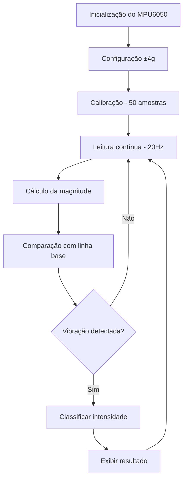

# DHT22 and MPU6050 - ESP32 Mqtt Connection


## Funcionamento do MPU6050 no Sistema de Detecção de Vibração

Este documento explica como o sensor **MPU6050** funciona no código de detecção de vibração apresentado.

## O que é o MPU6050

O MPU6050 é um sensor inercial muito popular que combina acelerômetro e giroscópio em um único chip. Vou explicar como funciona especificamente neste projeto:

### Características do Sensor
- **Sensor de movimento de 6 eixos (6-DOF)**
- **Aceleração** nos eixos X, Y e Z
- **Velocidade angular** (giroscópio) nos eixos X, Y e Z

> **Nota**: Neste código, apenas o **acelerômetro** está sendo utilizado para detectar vibrações.

## Funcionamento no Código

### 1. Inicialização

```cpp
#define MPU6050_ADDR 0x68  // Endereço I2C padrão
Wire.begin(SDA_PIN, SCL_PIN);  // Inicializa comunicação I2C
```

- **Endereço I2C**: 0x68 (padrão do MPU6050)
- **Comunicação**: Via protocolo I2C
- **Pinos utilizados**: SDA (GPIO 18) e SCL (GPIO 19)

### 2. Configuração do Sensor

```cpp
writeRegister(PWR_MGMT_1, 0x00);  // Acorda o MPU6050 (sai do modo sleep)
writeRegister(ACCEL_CONFIG, 0x08); // Configura para ±4g de sensibilidade
```

**Configurações aplicadas:**
- Sair do modo sleep (sensor ativo)
- Configurar acelerômetro para range ±4g
- Estabelecer comunicação estável

### 3. Leitura dos Dados

```cpp
void readAccelData() {
  Wire.beginTransmission(MPU6050_ADDR);
  Wire.write(ACCEL_XOUT_H);  // Registrador inicial dos dados do acelerômetro
  Wire.endTransmission(false);
  Wire.requestFrom(MPU6050_ADDR, 6, true);  // Solicita 6 bytes (2 por eixo)
  
  // Lê os dados brutos (16 bits por eixo)
  ax = Wire.read() << 8 | Wire.read();  // X
  ay = Wire.read() << 8 | Wire.read();  // Y  
  az = Wire.read() << 8 | Wire.read();  // Z
  
  // Converte para unidades de g (gravidade)
  accelX = ax / 8192.0;  // Para range ±4g
  accelY = ay / 8192.0;
  accelZ = az / 8192.0;
}
```

**Processo de leitura:**
1. Solicita dados do registrador ACCEL_XOUT_H
2. Lê 6 bytes consecutivos (2 bytes por eixo)
3. Combina os bytes para formar valores de 16 bits
4. Converte para unidades de aceleração (g)

### 4. Detecção de Vibração

O algoritmo calcula a **magnitude** do vetor aceleração:

```cpp
magnitude = sqrt(accelX² + accelY² + accelZ²)
```

**Princípio de funcionamento:**
- Em repouso: magnitude ≈ 1g (devido à gravidade terrestre)
- Com vibração: magnitude varia significativamente
- Desvio da linha base indica presença de vibração

### 5. Calibração

```cpp
void calibrateSensor() {
  // Faz várias leituras em repouso
  // Calcula a média para estabelecer a linha base
  baselineMagnitude = sumMagnitude / validSamples;
}
```

**Processo de calibração:**
- Realiza 50 leituras com o sensor em repouso
- Calcula a média das magnitudes
- Define a linha base para comparação futura
- Melhora a precisão da detecção

### 6. Classificação da Vibração

```cpp
float vibrationLevel = abs(magnitude - baselineMagnitude);

if (vibrationLevel > vibrationThreshold) {
  // Classifica como: LEVE, MODERADA, FORTE ou INTENSA
  // baseado no nível de desvio da linha base
}
```

**Níveis de classificação:**
- 🟢 **LEVE**: < 0.5g
- 🟡 **MODERADA**: 0.5g - 1.0g  
- 🟠 **FORTE**: 1.0g - 2.0g
- 🔴 **INTENSA**: > 2.0g

## Características Técnicas Utilizadas

| Parâmetro | Valor |
|-----------|--------|
| **Comunicação** | I2C (SDA/SCL) |
| **Resolução** | 16 bits por eixo |
| **Faixa configurada** | ±4g |
| **Taxa de amostragem** | 20Hz (a cada 50ms) |
| **Sensibilidade** | 8.192 LSB/g |
| **Endereço I2C** | 0x68 |

## Registradores Utilizados

| Registrador | Endereço | Função |
|-------------|----------|---------|
| **PWR_MGMT_1** | 0x6B | Gerenciamento de energia |
| **ACCEL_XOUT_H** | 0x3B | Dados do acelerômetro (início) |
| **ACCEL_CONFIG** | 0x1C | Configuração do acelerômetro |

## Vantagens do MPU6050

### ✅ Pontos Positivos
- **Baixo custo** e fácil integração
- **Baixo consumo** de energia
- **Alta precisão** para aplicações de detecção de movimento
- **Interface I2C simples**
- **Calibração automática** possível
- **Versatilidade** para diversas aplicações

### 🎯 Aplicações Ideais
- Detecção de vibrações em máquinas
- Monitoramento de estruturas
- Sistemas de alarme por movimento
- Análise de estabilidade
- Controle de qualidade industrial

## Fluxo de Funcionamento



## Comandos de Controle

O sistema oferece comandos via Serial para interação:

- `threshold:X.X` - Ajustar limiar de detecção
- `calibrate` - Recalibrar o sensor
- `reset` - Resetar estatísticas
- `test` - Testar funcionamento dos sensores
- `help` - Exibir lista de comandos

---

Este sistema é ideal para aplicações que requerem monitoramento contínuo de vibração com alta precisão e baixo custo.
